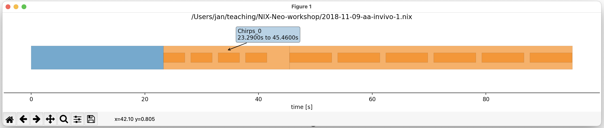

## The ``rlxnix.Dataset`` class

The *Dataset* class is the linchpin of the exploratory functionality offered by **rlxnix**. Upon creation of a Dataset instance, it will crawl through the file and index it, **this may take a little while**.

To get an initial overview, one can plot the timeline which shows which *RePro* was run when and illustrated the stimulus segments within the RePro runs.

```python
import rlxnix as rlx

filename = "data/2021-11-11-aa.nix"
dataset = rlx.Dataset(filename)
dataset.plot_timeline()
```



The mouse-over shows the name of the RePro and the time interval in which is was active. The darker rectangles show that two stimuli were presented while "SAM_2" was active.

Programmatically one can see the list of run RePros by ``dataset.repros``:

```python
dataset.repros
['BaselineActivity_1', 'SAM_1', 'SAM_2', 'SAM_3', 'Chirps_1']
````

Upon saving a relacs file, there will be a dialog popping up that asks for some metadata. Theses are attached to the data and can be displayed by

```python
print(dataset.metadata)

{'relacs-nix version': ([1.1], ''),
 'Recording': {'Recording quality': (['good'], ''),
  'Comment': ([''], ''),
  'Experimenter': (['John Doe'], ''),
  'WaterTemperature': ([298.15], 'K'),
  'WaterConductivity': ([300.0], 'uS/cm'),
  'Name': (['2021-11-11-aa'], ''),
  'Folder': (['/home/grewe/projects/programming/relacs/plugins/efish/2021-11-11-aa'],
   ''),
  'File': (['trace-1.raw'], ''),
  'Date': (['2021-11-11'], ''),
  'Time': (['15:33:13'], ''),
  'Recording duration': ([73.459], 's'),
  'Mode': (['Simulation'], ''),
  'Software': (['RELACS'], ''),
  'Software version': (['0.9.8'], '')},

        ...

  'Model': {'Name': (['Wang-Buzsaki'], ''),
   'Sodium current': {'gna': ([35.0], 'mS/cm^2'), 'ena': ([55.0], 'mV')},
   'Potassium current': {'gk': ([9.0], 'mS/cm^2'), 'ek': ([-90.0], 'mV')},
   'Leak current': {'gl': ([0.1], 'mS/cm^2'),
    'el': ([-65.0], 'mV'),
    'c': ([1.0], 'uF/cm^2'),
    'phi': ([5.0], '')},
   'Input': {'gain': ([50.0], ''), 'offset': ([6.0], 'uA/cm^2')}}}}
```

The metadata are stored in a dictionary and the values associated with a key are (unless again a dictionary) tuples containing the list of value(s) and the respective unit (which may be empty).
