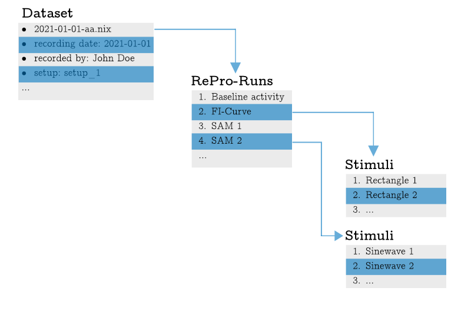
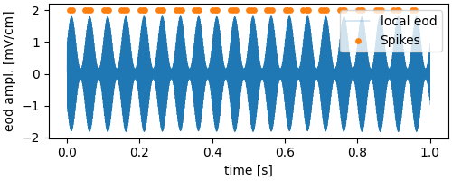

# Introduction

**rlxnix** objects represent the content of a relacs stored NIX file. The file content is modelled as three basic objects (see also figure 1).

1. The *Dataset*: This is the first and most important object that needs to be created by instantiation. It just needs the filename of the recorded file. The Dataset then contains the top-level metadata, i.e. the information that was provided in the file save dialog relacs asks you to fill upon saving a file. The dataset further offers access to the the **Re**search**Pro**tocols that have been run. 
2. *ReProRun*: Represents the run of a single RePro. It has properties such as the start and stop times of the RePro-run. The metadata contain the settings of the RePro. From here you can access the stimuli that have been applied during this run.
3. *Stimulus*: The Stimulus object offers access to the concrete stimulus settings (the metadata) and the data recorded during the stimulus presentations.



## The ``rlxnix.Dataset`` class

The *Dataset* class is the linchpin of the exploratory functionality offered by **rlxnix**. Upon creation of a Dataset instance, it will crawl through the file and index it, **this may take a little while**.

To get an initial overview, one can plot the timeline which shows which *RePro* was run when and illustrated the stimulus segments within the RePro runs.

```python
import rlxnix as rlx

filename = "data/2021-11-11-aa.nix"
dataset = rlx.Dataset(filename)
dataset.plot_timeline()
```


The mouse-over shows the name of the RePro and the time interval in which is was active. The darker rectangles show that two stimuli were presented while "SAM_2" was active.

Programmatically one can see the list of run RePros by ``dataset.repros``:

```python
dataset.repros
['BaselineActivity_1', 'SAM_1', 'SAM_2', 'SAM_3', 'Chirps_1']
````

Upon saving a relacs file, there will be a dialog popping up that asks for some metadata. Theses are attached to the data and can be displayed by

```python
print(dataset.metadata)

{'relacs-nix version': ([1.1], ''),
 'Recording': {'Recording quality': (['good'], ''),
  'Comment': ([''], ''),
  'Experimenter': (['John Doe'], ''),
  'WaterTemperature': ([298.15], 'K'),
  'WaterConductivity': ([300.0], 'uS/cm'),
  'Name': (['2021-11-11-aa'], ''),
  'Folder': (['/home/grewe/projects/programming/relacs/plugins/efish/2021-11-11-aa'],
   ''),
  'File': (['trace-1.raw'], ''),
  'Date': (['2021-11-11'], ''),
  'Time': (['15:33:13'], ''),
  'Recording duration': ([73.459], 's'),
  'Mode': (['Simulation'], ''),
  'Software': (['RELACS'], ''),
  'Software version': (['0.9.8'], '')},

        ...

  'Model': {'Name': (['Wang-Buzsaki'], ''),
   'Sodium current': {'gna': ([35.0], 'mS/cm^2'), 'ena': ([55.0], 'mV')},
   'Potassium current': {'gk': ([9.0], 'mS/cm^2'), 'ek': ([-90.0], 'mV')},
   'Leak current': {'gl': ([0.1], 'mS/cm^2'),
    'el': ([-65.0], 'mV'),
    'c': ([1.0], 'uF/cm^2'),
    'phi': ([5.0], '')},
   'Input': {'gain': ([50.0], ''), 'offset': ([6.0], 'uA/cm^2')}}}}
```

The metadata are stored in a dictionary and the values associated with a key are (unless again a dictionary) tuples containing the list of value(s) and the respective unit (which may be empty).

## Reading RePro data

From the overview we know that there were several RePro runs in the file and in order to access the data recorded during these we need to get the *ReProRun* entity, e.g. from the BaselineActivity:

```python
# get a list of ReProRuns who's names have "Baseline" in it
baseline_runs = dataset.repro_runs("Baseline")
baseline_0 = baseline_runs[0]

# if a specific ReProRun is needed:
baseline_0 = dataset.repro_runs('BaselineActivity_1', exact=True)[0]
# if exact is "False" (the default), e.g. 'BaselineActivity_12' would also match
```

### Easy data access with specialized classes

*relacs* controls the experiments with RePros, collections of RePros are called plugin sets. For example there is (among others) the efish plugin set. **rlxnix** classes made for representing *relacs* RePro data are stored in the ``rlxnix.plugins`` module.

For the *relacs* BaselineActivity repro there is an **rlxnix** equivalent class (defined in the ``rlxnix.plugins.efish.baseline`` module). Which offers some convenience methods:

```python
type(baseline_0)
rlxnix.plugins.efish.baseline.Baseline

print(baseline_0.baseline_rate)
59.43223443223443

print(baseline.baseline_cv)
0.07113413039235926
```

The ``Baseline`` class provides direct access to the spikes, the local eod and the membrane_voltage.

```python
import numpy as np
import matplotlib.pyplot as plt

spike_times = baseline_0.spikes()
membrane_voltage, time = baseline_0.membrane_voltage()
local_eod, eod_time = baseline_0.local_eod()

fig, axes = plt.subplots(nrows=2, figsize=(5, 3), sharex=True, constrained_layout=True)
axes[0].plot(eod_time, local_eod, label="eod", lw=0.5)
axes[0].set_ylabel("eod amplitude [mV/cm]")
axes[0].set_xlabel("time [s]")
axes[0].set_xlim(0, 0.25)
axes[0].legend(loc=1)

axes[1].plot(time, membrane_voltage, color="tab:green", lw=0.25, label="membrane potential")
axes[1].scatter(spike_times, np.ones_like(spike_times) * np.max(membrane_voltage), s=10, c="tab:orange", label="spikes")
axes[1].set_ylabel("membrane potential [mV]")
axes[1].set_xlabel("time [s]")
axes[1].set_xlim(0, 0.25)
axes[1].legend(loc=1)
plt.show()
```


The ``rlxnix.plugins.efish.baseline.Baseline`` class is derived from ``rlxnix.base.repro.ReProRun`` class (actually, it inherits functionality from the superclass ``rlxnix.plugins.efish.efish_ephys_repro.EfishEphys`` class which is derived from ``rlxnix.base.repro.ReProRun``). If **rlxnix** cannot find a matching class for a given relacs RePro, an instance of the ``rlxnix.base.repro.ReProRun`` class will be created.
At this time, there is no matching class for the **SAM** RePro.

```python
sam = dataset.repro_runs("sam")[0]
type(sam)
rlxnix.base.repro.ReProRun
```

### The ``ReProRun`` class

The ``ReProRun`` class does not offer any syntactic sugar as the ``Baseline`` class does but one can nevertheless get all the data and information from the basic ``ReProRun`` class with only a little more effort.

```python
print(sam)
Repro: SAM_1     type: relacs.repro_run
        start time: 10.92s      duration: 2.23s

print(sam.start_time, sam.stop_time, sam.duration)
10.92 13.15 2.23

print(sam.metadata)
{'reprofiles': (  ...  )),
 'RePro-Info': {'RePro': (['SAM'], ''),
  'Author': (['Jan Benda'], ''),
  'Version': (['2.5'], ''),
  'Date': (['Sep 28, 2017'], ''),
  'Run': ([1], ''),
  'macros': {'SAMs AM': ([''], '')},
  'settings': {'duration': ([1.0], 's'),
   'pause': ([0.1], 's'),
   'freqsel': (['relative to EOD'], ''),
   'deltaf': ([20.0], 'Hz'),
   'contrast': ([0.05], ''),
   'repeats': ([2], ''),
   'am': ([True], ''),
   'sinewave': ([True], ''),
   'ampl': (['0.0'], ''),
   'phase': (['0.0'], 'pi'),
   'contrastsel': (['fundamental'], ''),
   'skip': ([0.5], 'Periods'),
   'ratebins': ([10], ''),
   'before': ([0.0], 's'),
   'after': ([0.0], 's'),
   'adjust': ([True], '')}}}
```

In contrast to the ``Baseline`` class we have no direct access to the spikes or the membrane voltage. In order to access them we need to gather some information such as the name of the signal (or trace) that we want.

```python
sam.traces   # this property holds the recorded signals/traces
['EOD',
 'LocalEOD-1',  # <-- the local eod trace
 'GlobalEFieldStimulus',
 'V-1',   # <-- this is the membrane voltage
   ... 
 'Spikes-1',  # <-- and here are the spikes
 'EOD_events']

sam.trace_info("Spikes-1")
DataTrace (Name: 'Spikes-1', DataArray: 'bca8b128-88b1-48b8-876e-f2ad468bf30b', DataType: <DataType.Event: 1>)

sam.trace_info("LocalEOD-1")
Out[58]: DataTrace (Name: 'LocalEOD-1', DataArray: 'daae0054-cea4-4dc7-8d75-8c12e5f26c7c', DataType: <DataType.Continuous: 0>)

sam_spike_times, _ = sam.trace_data("Spikes-1")
sam_eod, sam_time = sam.trace_data("LocalEOD-1")
```

``ReProRun.trace_data`` expects at least one argument, the trace name. It always returns two values. The first is the recorded data and the second is the respective time axis (if the data type is continuous, for *V-1* or *LocalEOD-1*) or ``None`` (if the data type is events, *Spikes-1*). By default the time or the times of the event traces will be given relative to the RePro start. If absolute times are required on can pass ``rlx.TimeReference.Absolute`` to ``trace_data``.

Let's plot the data...

```python
fig, axis = plt.subplots(figsize=(5, 2), constrained_layout=True)
axis.plot(sam_time, sam_eod, lw=0.25, label="local eod")
axis.scatter(sam_spike_times, np.ones_like(sam_spike_times) * 1.1 * np.max(sam_eod), color="tab:orange", s=15, label="Spikes")
axis.set_xlabel("time [s]")
axis.set_ylabel("eod ampl. [mV/cm]")
axis.legend(loc=1)
plt.show()
```


The SAM RePro ran for a little more than 2 seconds. In this time, we observe several distinct segments in the data at which the *local eod* amplitude is stable, and others in which it is (sinusoidally) modulated. The latter are the times in which a stimulus was active.

## ``rlxnix.base.Stimulus`` class represents stimulus segments

Ok, in this run of the *SAM* RePro, there are two stimulus segments. The stimulus segments are represented by the ``rlxnix.base.Stimulus``.

```python
sam.stimuli
[Stimulus object for stimulus output from 10.9405 to 11.9405s of MultiTag 3340ffe5-3aa1-4b9c-a931-8860f25dac3a at 0x15a3918b0,
 Stimulus object for stimulus output from 12.0405 to 13.0405s of MultiTag 3340ffe5-3aa1-4b9c-a931-8860f25dac3a at 0x15a391280]

# let's take the first one
stimulus = sam.stimuli[0]

print(stimulus)
Stimulus: SAM, C=5%, Df=20.0Hz, AM-1     type: relacs.stimulus.segment
        start time: 10.94s, duration: 1.00s
```

While the metadata attached to the ``ReProRun`` contains the basic settings of the *relacs* RePro, the metadata attached to the stimulus contain information related to this particular stimulus segment.

```python
stimulus.metadata
{'SAM, C=5%, Df=20.0Hz, AM-1': {'Modality': (['electric'], ''),
  'SamplingRate': ([40.0], 'kHz'),
  'StartTime': ([0.0], 's'),
  'Duration': ([1.0], 's'),
  'Amplitude': ([1.0], 'V'),
  'Contrast': ([5.0], '%'),
  'Frequency': ([20.0], 'Hz'),
  'DeltaF': ([20.0], 'Hz'),
  'Phase': ([0.0], ''),
  'EODf': ([800.6268881023378], 'Hz')}}
```

To read the data we can apply exactly the same methods as before (for those interested, this functionality is inherited from the common ancestor, ``rlxnix.base.trace_container``).

```python
sam_stim_spike_times, _ = stimulus.trace_data("Spikes-1")
sam_stim_eod, sam_stim_time = stimulus.trace_data("LocalEOD-1")

fig, axis = plt.subplots(figsize=(5, 2), constrained_layout=True)
axis.plot(sam_stim_time, sam_stim_eod, lw=0.25, label="local eod")
axis.scatter(sam_stim_spike_times, np.ones_like(sam_stim_spike_times) * 1.1 * np.max(sam_stim_eod), color="tab:orange", s=15, label="Spikes")
axis.set_xlabel("time [s]")
axis.set_ylabel("eod ampl. [mV/cm]")
axis.legend(loc=1)
plt.show()
```



Voilà, now you are ready to go and dig into your data. The patterns shown above apply to any of the RePro classes in **rlxnix**, no matter whether there are RePro specific classes or not. The specialized classes defined in e.g. ``rlxnix.plugins.efish`` just offer some more sugar.
