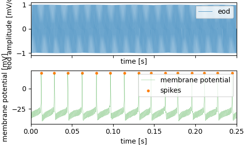
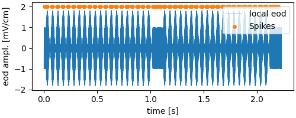

# Reading RePro data

From the overview we know that there were several **RePro** runs in the file and in order to access the data recorded during these, we need to get the *ReProRun* entity, e.g. the BaselineActivity:

```python
# get a list of ReProRuns who's names have "Baseline" in it
baseline_runs = dataset.repro_runs("Baseline")
baseline = baseline_runs[0]

# if a specific ReProRun is required and the name is known:
baseline = dataset.repro_runs('BaselineActivity_1', exact=True)[0]
# if exact is "False" (the default), e.g. 'BaselineActivity_12' would also match
# alternatively, you can directly access the ReproRun by
baseline = dataset["BaselineActivity_1"]
```

## Easy data access with specialized classes

*relacs* controls the experiments with **RePros**, collections of **RePros** are called plugin sets. For example, there is (among others) the *efish* plugin set. **rlxnix** classes made for representing *relacs* RePro data are stored in the ``rlxnix.plugins`` module.

For the *relacs* BaselineActivity repro there is an **rlxnix** equivalent class (defined in the ``rlxnix.plugins.efish.baseline`` module). Which offers some convenience methods:

```python
type(baseline)
rlxnix.plugins.efish.baseline.Baseline

print(baseline.baseline_rate)
59.43223443223443

print(baseline.baseline_cv)
0.07113413039235926
```

The ``Baseline`` class provides direct access to the spikes, the local eod, the global eod, and the membrane_voltage.

```python
import numpy as np
import matplotlib.pyplot as plt

spike_times = baseline.spikes()
membrane_voltage, time = baseline.membrane_voltage()
local_eod, eod_time = baseline.local_eod()

fig, axes = plt.subplots(nrows=2, figsize=(5, 3), sharex=True, constrained_layout=True)
axes[0].plot(eod_time, local_eod, label="eod", lw=0.5)
axes[0].set_ylabel("eod amplitude [mV/cm]")
axes[0].set_xlabel("time [s]")
axes[0].set_xlim(0, 0.25)
axes[0].legend(loc=1)

axes[1].plot(time, membrane_voltage, color="tab:green", lw=0.25, label="membrane potential")
axes[1].scatter(spike_times, np.ones_like(spike_times) * np.max(membrane_voltage), s=10, c="tab:orange", label="spikes")
axes[1].set_ylabel("membrane potential [mV]")
axes[1].set_xlabel("time [s]")
axes[1].set_xlim(0, 0.25)
axes[1].legend(loc=1)
plt.show()
```



The ``rlxnix.plugins.efish.baseline.Baseline`` class is derived from ``rlxnix.base.repro.ReProRun`` class (actually, it inherits functionality from the superclass ``rlxnix.plugins.efish.efish_ephys_repro.EfishEphys`` class which is derived from ``rlxnix.base.repro.ReProRun``). If **rlxnix** cannot find a matching class for a given relacs RePro, an instance of the ``rlxnix.base.repro.ReProRun`` class will be created.
At this time, there is no matching class for the **SAM** RePro.

```python
sam = dataset.repro_runs("sam")[0]
type(sam)
rlxnix.base.repro.ReProRun
```

## The ``ReProRun`` class

The ``ReProRun`` class does not offer any syntactic sugar as the ``Baseline`` class does but one can nevertheless get all the data and information from the basic ``ReProRun`` class with only a little more effort.

```python
print(sam)
Repro: SAM_1     type: relacs.repro_run
        start time: 10.92s      duration: 2.23s

print(sam.start_time, sam.stop_time, sam.duration)
10.92 13.15 2.23

print(sam.metadata)
{'reprofiles': (  ...  )),
 'RePro-Info': {'RePro': (['SAM'], ''),
  'Author': (['Jan Benda'], ''),
  'Version': (['2.5'], ''),
  'Date': (['Sep 28, 2017'], ''),
  'Run': ([1], ''),
  'macros': {'SAMs AM': ([''], '')},
  'settings': {'duration': ([1.0], 's'),
   'pause': ([0.1], 's'),
   'freqsel': (['relative to EOD'], ''),
   'deltaf': ([20.0], 'Hz'),
   'contrast': ([0.05], ''),
   'repeats': ([2], ''),
   'am': ([True], ''),
   'sinewave': ([True], ''),
   'ampl': (['0.0'], ''),
   'phase': (['0.0'], 'pi'),
   'contrastsel': (['fundamental'], ''),
   'skip': ([0.5], 'Periods'),
   'ratebins': ([10], ''),
   'before': ([0.0], 's'),
   'after': ([0.0], 's'),
   'adjust': ([True], '')}}}
```

In contrast to the ``Baseline`` class we have no direct access to the spikes or the membrane voltage. In order to access them we need to gather some information such as the name of the signal (or trace) that we want.

```python
sam.traces   # this property holds the recorded signals/traces
['EOD',
 'LocalEOD-1',  # <-- the local eod trace
 'GlobalEFieldStimulus',
 'V-1',   # <-- this is the membrane voltage
   ... 
 'Spikes-1',  # <-- and here are the spikes
 'EOD_events']

sam.trace_info("Spikes-1")
DataTrace (Name: 'Spikes-1', DataArray: 'bca8b128-88b1-48b8-876e-f2ad468bf30b', DataType: <DataType.Event: 1>)

sam.trace_info("LocalEOD-1")
Out[58]: DataTrace (Name: 'LocalEOD-1', DataArray: 'daae0054-cea4-4dc7-8d75-8c12e5f26c7c', DataType: <DataType.Continuous: 0>)

sam_spike_times, _ = sam.trace_data("Spikes-1")
sam_eod, sam_time = sam.trace_data("LocalEOD-1")
```

``ReProRun.trace_data`` expects at least one argument, the trace name. It always returns two values. The first is the recorded data and the second is the respective time axis (if the data type is continuous, for *V-1* or *LocalEOD-1*) or ``None`` (if the data type is events, *Spikes-1*). By default the time or the times of the event traces will be given relative to the RePro start. If absolute times are required on can pass ``rlx.TimeReference.Absolute`` to ``trace_data``.

Let's plot the data...

```python
fig, axis = plt.subplots(figsize=(5, 2), constrained_layout=True)
axis.plot(sam_time, sam_eod, lw=0.25, label="local eod")
axis.scatter(sam_spike_times, np.ones_like(sam_spike_times) * 1.1 * np.max(sam_eod), color="tab:orange", s=15, label="Spikes")
axis.set_xlabel("time [s]")
axis.set_ylabel("eod ampl. [mV/cm]")
axis.legend(loc=1)
plt.show()
```



The SAM RePro ran for a little more than 2 seconds. In this time, we observe several distinct segments in the data at which the *local eod* amplitude is stable, and others in which it is (sinusoidally) modulated. The latter are the times in which a stimulus was active.
